<!-- ==================== HEADER ==================== -->

  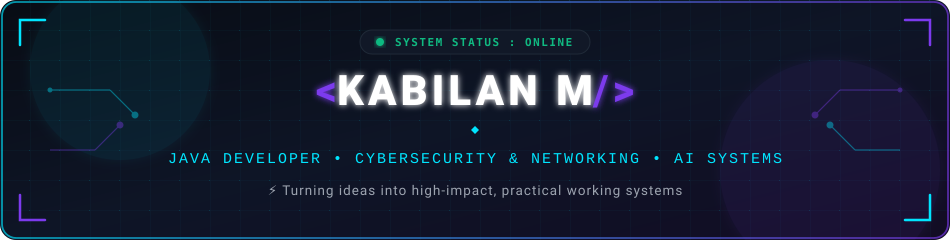

  

  
  
  
  

  

<!-- ==================== SECTION 01: ABOUT ME ==================== -->

  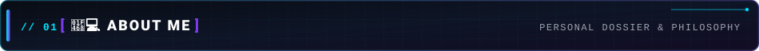

  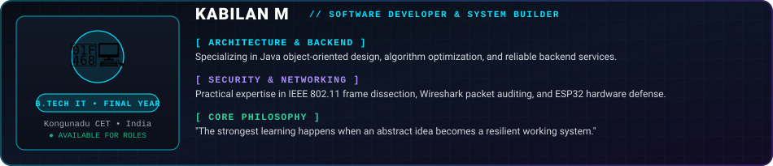

  

  I'm <b>Kabilan M</b>, a final-year <b>B.Tech Information Technology</b> student in India passionate about software engineering and resilient systems.
   
  My primary focus centers on <b>Java Architecture, Object-Oriented Design, Cybersecurity, Computer Networking, and Practical AI</b>.
   
  I enjoy dissecting technical challenges, analyzing low-level protocol dynamics, and translating theoretical concepts into high-impact software.

  
  
  
  

<!-- ==================== SECTION 02: CORE FOCUS ==================== -->

  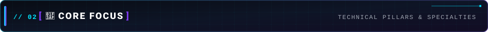

  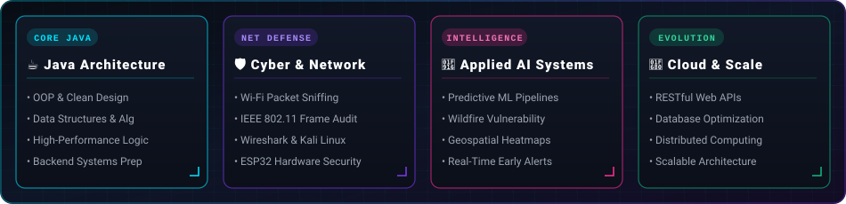

<!-- ==================== SECTION 03: FEATURED PROJECTS ==================== -->

  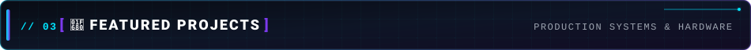

  <a href="https://github.com/kabilanm1409/AI-Powered-Forest-Fire-Prediction" target="_blank">
    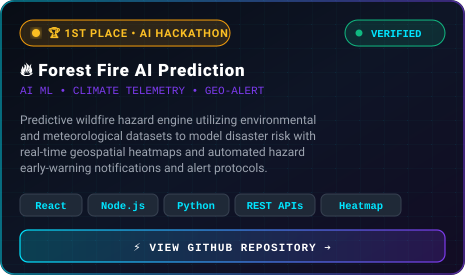
  </a>
  <a href="#-section-04-cybersecurity--networking">
    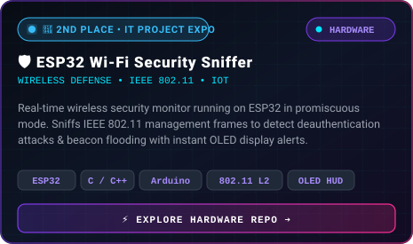
  </a>

<!-- ==================== SECTION 04: CYBERSECURITY & NETWORKING ==================== -->

  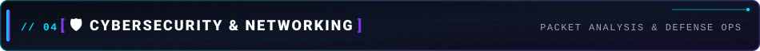

  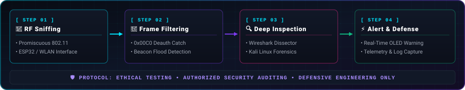

  
  
  
  

<!-- ==================== SECTION 05: TECH STACK & TOOLING ==================== -->

  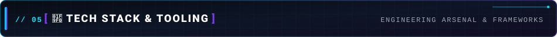

  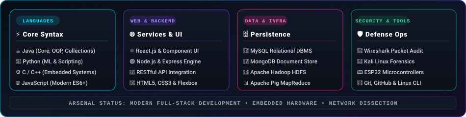

  
<b>⚡ Programming Languages</b>

  

    
  

  
<b>🌐 Web &amp; Backend Engineering</b>

  

    
  

  
<b>🗄️ Databases &amp; Big Data</b>

  

    
  

  

    
    
    
  

  
<b>🛡️ Security, Hardware &amp; Networking</b>

  

    
    
    
    
  

  
<b>⚙️ Developer Environment &amp; Platforms</b>

  

    
  

<!-- ==================== SECTION 06: PROFESSIONAL EXPERIENCE ==================== -->

  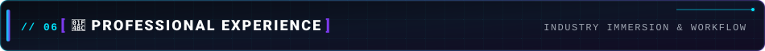

  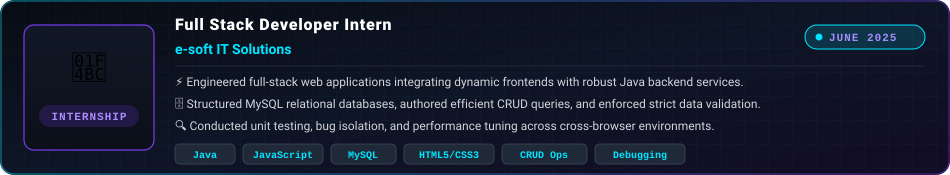

<!-- ==================== SECTION 07: EDUCATION MATRIX ==================== -->

  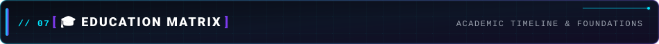

  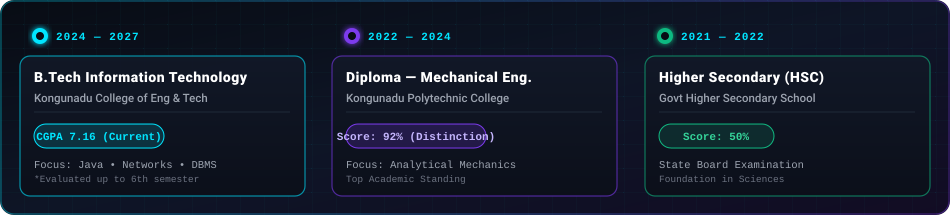

<!-- ==================== SECTION 08: HONORS & ACHIEVEMENTS ==================== -->

  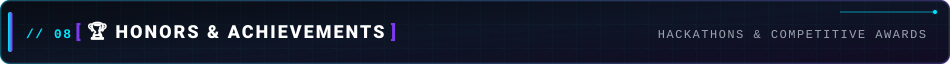

  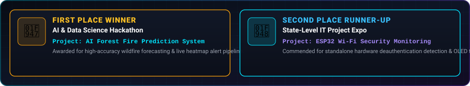

<!-- ==================== SECTION 09: VERIFIED CERTIFICATIONS ==================== -->

  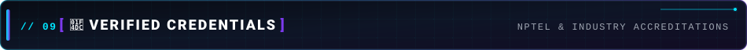

  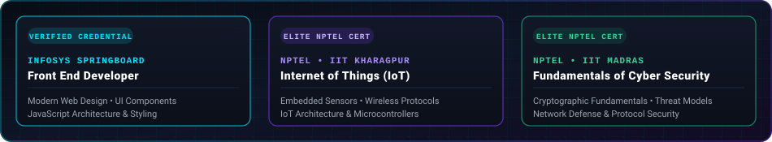

<!-- ==================== SECTION 10: GITHUB ANALYTICS ==================== -->

  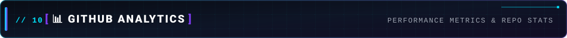

  
  

  

<!-- ==================== SECTION 11: SYSTEM ACTIVITY & ROADMAP ==================== -->

  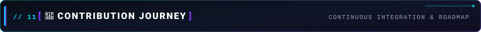

  

  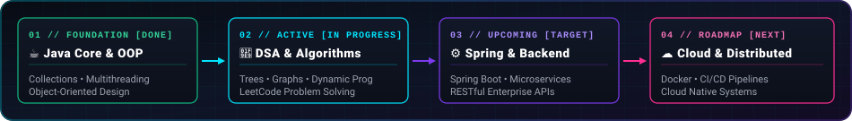

<!-- ==================== SECTION 12: CONNECT & TRANSMIT ==================== -->

  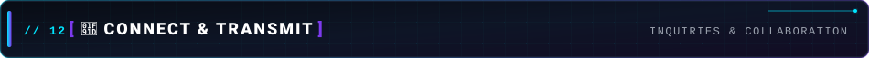

  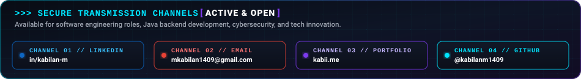

  
  
  
  

<!-- ==================== FOOTER ==================== -->

  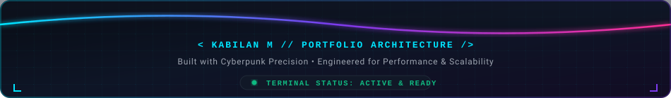

